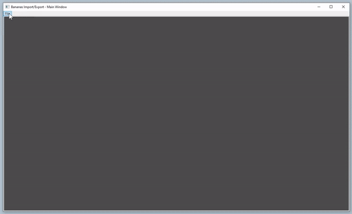
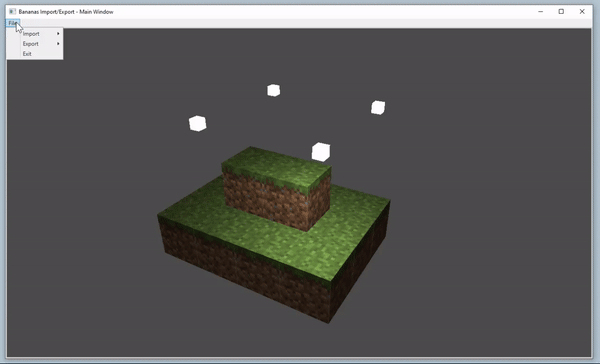

# Bananas Import/Export Tool

A tool that imports and exports Wavefront files (.obj/.mtl). Rendering is done with OpenGL. The Win32 API is used to create a window to host inside of a C# WPF application. The C++/CLI layer is used to communicate between native C++ and C# WPF.

Technologies:
- Win32 API to create window for Open GL context
- GLAD OpenGL window toolkit for Rendering
- C++/CLI layer to communicate between native C++ and C# WPF
- C# WPF(Windows Presentation Foundation) for User Interface

Camera Movement:
- (Hold) Middle Mouse Button - Move mouse around to move the camera up, down, left and right
- (Hold) W Key - Move forward
- (Hold) S Key - Move backward
- (Hold) A Key - Pan left
- (Hold) D Key - Pan right

## Import

    

## Export

    

